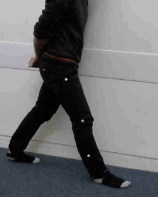
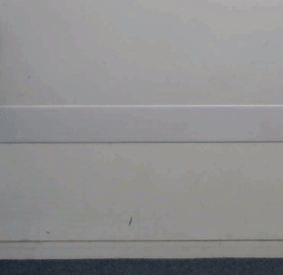

# Marker Tracking

## Why do we need to track the markers?

We track the markers to determine joint angles. Joint angles are import for diagnosising neurological disorders, issues with prosthetics.

In order to get accurate continuous joint angles, we need to know a 3D continous path. To map the markers accurately to a 3D position: two continous 2D paths from different camera angles are required. Using vector mathematics, we can find where the mackers are in 3D fro the two 2D sequences.

### How it works:

The each frame the markers - white & yellow balls - are detected using a convolutional neural network, the programs goal is to determine which sequence a marker belongs to. Occasionally some markers will be missed in a frame or a false marker will be picked up, the program has to filter out these points or interpolate the missing points.

To do this, it looks for markers the follow a path, under the assumption errors will occur randomly and not in a sequence. Several other features are used to classify if the marker belongs to a path. 

### How to use it:

Step 1: (Annotate Data)

	label_videos.py: annotation to label videos, most effective at labeling incorrect images. 

Step 2: (Train model)
	
	train_model.py: train the model on the images in labels folder, stores the model to the saved_models folder

Step 3: (Analyse videos of patient's gait)

	analyse_videos.py: analyses the video & stores the balls in a pickle file.

Step 4: (Plot the analysis)

	plot_path.py: plays video and outputs a video with pickle file details.

Extra files info:

	balls.pkl - pickle file containing balls paths
	run_model - file to run the tensorflow cnn

To Do:
	
	1) Improve plot path - fix logic to show the previous x number of frames
	2) Normalised dot product - similarity between images
	3) Add velocity and acceleration of points. (For low velocity consider points in a sphere, for higher velocity consider points in a cone)
	4) Improve the annotation software to be better for labelling correct images. (eg click on closest -> ball/not ball)
	5) Threshold for distance between points (Check if the change in velocity is very rapid, if it is lower threshold)
